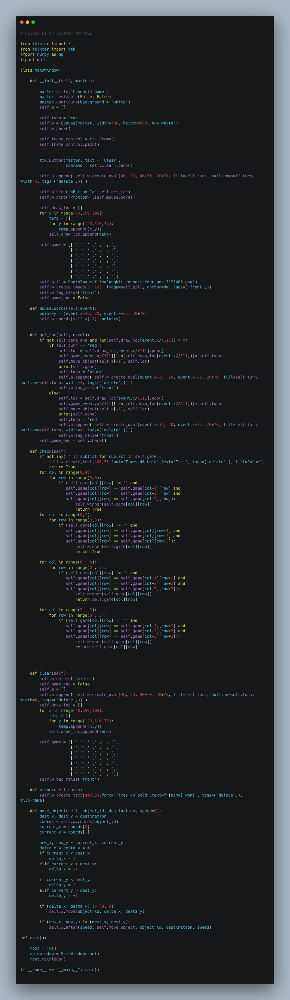

# connect4
connect4 game using python Tkinter canvas




## This is a connect4 Game.

#### The modules Used to make this script are:-

        -tkinter
        -numpy
        -math

This is a GUI based python script.

## Install

Python Code On windows machine:

clone connect4 repository on local machine.
```

> git clone https://github.com/geosaleh/connect4

```
change directory to connect4
```

> cd connect4/

```

Now its time to execute **connect4.py**
```

> python connect4.py

```
it will show following Output


## Download
:paperclip: [Download Here](https://github.com/geosaleh/connect4/archive/refs/heads/main.zip)

Hope you'll install it in your computer just to try .


```
follow us on twitter @geo_saleh
```
